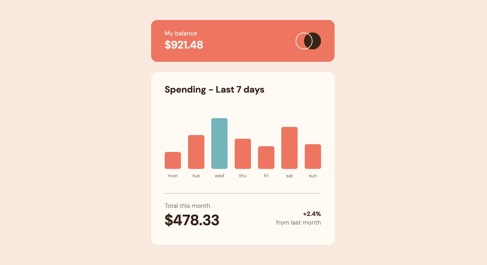

# Frontend Mentor - Expenses chart component

## Overview

### The assignment

Build out the fees chart component and get it looking as close to the design as possible.
The app absorbs the data from a `data.json` file and dynamically add the bars to html.

Users should be able to:

- View the bar chart and hover over the individual bars to see the correct amounts for each day
- See the current day's bar highlighted in a different colour to the other bars
- View the optimal layout for the content depending on their device's screen size
- See hover states for all interactive elements on the page
- See dynamically generated bars based on the data provided in the local JSON file

### Screenshot

### Links

- Solution URL: [Frontend Mentor](https://www.frontendmentor.io/solutions/expenses-chart-component-main)
- Live Site URL: [Github Pages](https://kimchiver.github.io/expenses-chart-component-main)

### Built with

- HTML5, CSS
- JQuery 3.7.1

## Author

- Frontend Mentor - [@kimchiver](https://www.frontendmentor.io/profile/kimchiver)
- Github - [@kimchiver](https://github.com/kimchiver)
